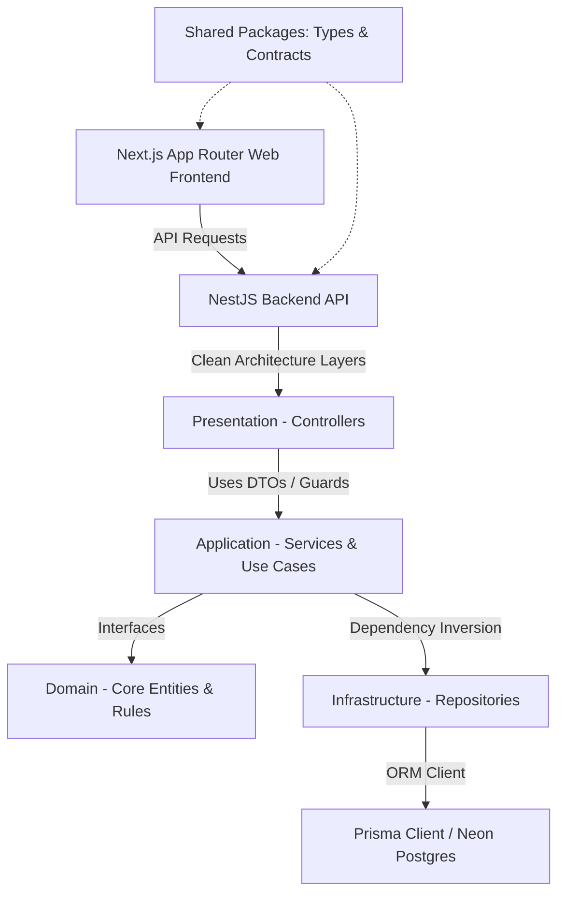

# The Software Guys - SaaS Portfolio Platform
## Technical Implementation Plan & UI/UX Analysis Report

This document outlines the complete architectural design, design system analysis, and step-by-step implementation strategy for the official, production-grade portfolio and admin dashboard platform of **The Software Guys**.

---

## 1. UI/UX & STITCH DESIGN SYSTEM ANALYSIS

We have extracted and thoroughly analyzed the Stitch project designs (`ID: 7307430621799602901`). The UI/UX is built on a highly striking, high-contrast, developer-centric **Neo-Brutalist** aesthetic combined with polished modern layouts. It balances the quirky, approachable brand personality of "The Software Guys" with an extremely rigorous, premium technical execution.

### A. Core Color Palette
The design system defines two color contexts: the **Core Palette** (fidelity spec) and the **Tailwind Tokens** generated in the Stitch HTML templates. We will map these exactly:
* **Background/Surface Light:** `#F8FAFC` (Clean background) / `#EAEAEA` (Slightly softer warm gray card container backdrop for visual depth).
* **Primary (Electric Blue):** `#003EC7` (Tailwind Spec) / `#005CFF` (Brand Override). Used for high-impact buttons, active sidebar tabs, focused input boundaries, and primary highlights.
* **Secondary (Soft Sulphur/Yellow):** `#F3E576` (Tailwind Spec) / `#FEFFB0` (Brand Override). Used for secondary badges, special highlighted text blocks (`-rotate-2` span containers), and offset brutalist flat shadows.
* **Tertiary (Deep Midnight / High-Contrast Dark):** `#050B1A` / `#1A1C1C`. Used for all body text, solid 3px borders, and solid retro drop shadows to ensure maximum AA/AAA accessibility.
* **Tonal Accents:**
  * Success Badges / Status: BG `#D1FAD7`, Text `#00682A` (with matching solid `#1A1C1C` borders).
  * Error States / Containers: BG `#FFDAD6`, Text `#93000A` / `#BA1A1A`.

### B. Typography
The typeface system relies on geometric precision and blocky, technical tracking:
* **Font Family:** `Geist` (as defined in the design token specs) / `Work Sans` (fallback and core loading font utilized in the Stitch mockups).
* **Headlines / Displays:** `Work Sans` or `Geist Sans`, Bold to Black (`800`/`900` weight), tight tracking (`letter-spacing: -0.04em`), forced uppercase with extreme leading (`leading-[0.9]` to `leading-[1.1]`).
* **Body Text:** base `16px` (`body-md`), large `18px` (`body-lg`), normal weight (`400`/`500`).
* **Labels / Micro-copy:** Medium/SemiBold (`600`/`700` weight), uppercase, tracker-spaced (`letter-spacing: 0.05em`).

### C. Layout, Elevation, & Grid
* **Desktop Grid:** 12-column grid with a consistent 24px gutter and 48px page margins. Max container layout width: 1440px.
* **Mobile Grid:** 4-column fluid layout with 16px horizontal margins.
* **Brutalist Elevation (Solid Offset Shadows):**
  * **Default Cards / Inputs:** `shadow-[6px_6px_0px_0px_#1A1C1C]` or `shadow-[4px_4px_0px_0px_#1A1C1C]`.
  * **Primary Accents:** `shadow-[8px_8px_0px_0px_#003EC7]` (Electric Blue offset).
  * **Secondary Accents:** `shadow-[8px_8px_0px_0px_#F3E576]` (Soft Sulphur offset).
* **Borders:** Universal solid dark borders of `border-[3px] border-[#1A1C1C]` or `border-[4px] border-[#1A1C1C]`.
* **Corner Radius:**
  * Public Frontend elements (Hero, Bento Grid, Buttons): `rounded-none` (0px sharp edges).
  * Brand Guidelines allow `rounded-md` (8px / `0.5rem`) for standard buttons/inputs and `rounded-lg` (16px / `1rem`) for cards to balance modern SaaS aesthetics. The selected preview styling balances both perfectly to match the agreed design visual.

### D. Interactive States & Micro-Animations
The site must feel alive and tactical. We will implement smooth CSS transitions for:
* **Brutalist Hover Translation:** On hover, elements translate up/left, and their solid shadow shrinks, creating a realistic "press" effect:
  ```css
  .neo-hover-translate {
      transition: transform 0.1s ease-in-out, box-shadow 0.1s ease-in-out;
  }
  .neo-hover-translate:hover {
      transform: translate(2px, 2px);
      box-shadow: 4px 4px 0px 0px #1A1C1C;
  }
  .neo-hover-translate:active {
      transform: translate(6px, 6px);
      box-shadow: 0px 0px 0px 0px #1A1C1C;
  }
  ```
* **Focused Inputs:** A thick `border-[4px] border-[#003EC7]` or background transition to `#DDE1FF` upon selection.
* **Animations on Scroll (AOS):** Custom scroll intersection observers animating the timeline line heights (`scale-y-0` to `scale-y-100`) and bento card fade-ins (`translate-y-10` to `translate-y-0`).

### E. Responsive Design & Mobile Execution
The mobile layout uses a fluid stacking order. Reusable components (e.g. Navigation) transition from a desktop horizontal bar to a collapsible mobile panel (`menu` toggling drawer) and a bottom contact-bar for quick user interactions.

---

## 2. SYSTEM ARCHITECTURE & MONOLITH DESIGN

We will build a **Modular Monolith** using a monorepo setup controlled via npm/pnpm workspaces. This gives us clear separation of concerns, sharing types and schema layers, while ensuring high deployment cohesion.



### Folder Structure
```
/
├── apps/
│   ├── web/                     # Next.js App Router Web Frontend
│   │   ├── src/
│   │   │   ├── app/             # App Router pages (/, /showcases, /services, /contact, /admin)
│   │   │   ├── components/      # UI components (atoms, molecules, layouts)
│   │   │   ├── lib/             # API client, utility functions
│   │   │   └── hooks/           # Custom React hooks (e.g., TanStack Query)
│   │   ├── tailwind.config.ts
│   │   └── package.json
│   └── api/                     # NestJS API Backend
│       ├── src/
│       │   ├── app.module.ts
│       │   ├── common/          # Global filters, interceptors, guards
│       │   └── modules/         # Feature Modules (Clean Architecture structure)
│       │       ├── leads/       # Contact Form & Newsletter Leads
│       │       ├── showcases/   # Showcase / Portfolio Management
│       │       └── admin/       # Admin Auth & Management
│       └── package.json
├── packages/
│   ├── db/                      # Shared Database & ORM (Prisma)
│   │   ├── prisma/
│   │   │   └── schema.prisma
│   │   └── src/index.ts
│   └── types/                   # Shared TypeScript Interfaces & DTOs
│       └── src/index.ts
├── package.json                 # Monorepo Workspace Config
└── turbo.json
```

---

## 3. DATABASE SCHEMA DESIGN (Neon PostgreSQL & Prisma)

The database will be hosted on Neon PostgreSQL. Here is the highly optimized relational schema configured for Prisma.

```prisma
datasource db {
  provider = "postgresql"
  url      = env("DATABASE_URL")
}

generator client {
  provider = "prisma-client-js"
}

// 1. ADMIN USER & AUTHENTICATION
model Admin {
  id           String        @id @default(uuid())
  email        String        @unique
  passwordHash String
  name         String
  role         AdminRole     @default(EDITOR)
  sessions     Session[]
  createdAt    DateTime      @default(now())
  updatedAt    DateTime      @updatedAt
}

enum AdminRole {
  SUPERADMIN
  EDITOR
}

model Session {
  id        String   @id @default(uuid())
  adminId   String
  token     String   @unique
  expiresAt DateTime
  admin     Admin    @relation(fields: [adminId], references: [id], onDelete: Cascade)
  createdAt DateTime @default(now())
}

// 2. PORTFOLIO & SHOWCASE MANAGEMENT
model Showcase {
  id              String          @id @default(uuid())
  title           String
  subtitle        String
  slug            String          @unique
  description     String
  category        String          // e.g. "Web Application", "Mobile App"
  clientName      String
  projectUrl      String?
  mainImage       String
  isFeatured      Boolean         @default(false)
  isPublished     Boolean         @default(false)
  technologies    ShowcaseTech[]
  assets          ShowcaseAsset[]
  seoMetadata     SEOMetadata?    @relation(fields: [seoMetadataId], references: [id])
  seoMetadataId   String?         @unique
  createdAt       DateTime        @default(now())
  updatedAt       DateTime        @updatedAt
}

model ShowcaseAsset {
  id         String    @id @default(uuid())
  showcaseId String
  type       AssetType @default(IMAGE)
  url        String
  altText    String?
  position   Int       @default(0)
  showcase   Showcase  @relation(fields: [showcaseId], references: [id], onDelete: Cascade)
  createdAt  DateTime  @default(now())
}

enum AssetType {
  IMAGE
  VIDEO
}

model ShowcaseTech {
  id         String   @id @default(uuid())
  showcaseId String
  name       String
  category   String   // e.g., "Frontend", "Backend", "Database"
  icon       String?  // Lucide Icon name or material symbol tag
  showcase   Showcase @relation(fields: [showcaseId], references: [id], onDelete: Cascade)
  createdAt  DateTime @default(now())
}

// 3. LEADS & CONTACT FORM SUBMISSIONS
model ContactLead {
  id          String     @id @default(uuid())
  firstName   String
  lastName    String
  email       String
  projectType String     // e.g., "Custom SaaS", "UI/UX Design", "Mobile App", "Other"
  message     String
  status      LeadStatus @default(PENDING)
  ipAddress   String?
  createdAt   DateTime   @default(now())
  updatedAt   DateTime   @updatedAt
}

enum LeadStatus {
  PENDING
  REVIEWED
  CONTACTED
  ARCHIVED
}

model NewsletterLead {
  id        String   @id @default(uuid())
  email     String   @unique
  active    Boolean  @default(true)
  ipAddress String?
  createdAt DateTime @default(now())
  updatedAt DateTime @updatedAt
}

// 4. SEO & DYNAMIC METADATA
model SEOMetadata {
  id              String    @id @default(uuid())
  path            String    @unique // e.g. "/services", "/showcases/nexus-analytics"
  metaTitle       String
  metaDescription String
  ogImage         String?
  keywords        String[]
  isOptimized     Boolean   @default(false)
  showcase        Showcase?
  createdAt       DateTime  @default(now())
  updatedAt       DateTime  @updatedAt
}
```

---

## 4. API ROUTING & STRUCTURAL CONTRACTS

All API endpoints will be served from NestJS (`/api/v1`) with full request/response DTO validations via `class-validator`.

### A. Public Endpoints
* **`POST /api/v1/leads/contact`**: Submit contact form.
  * *Request DTO:* `{ firstName: string, lastName: string, email: string, projectType: string, message: string }`
  * *Response:* `{ success: true, leadId: string }`
* **`POST /api/v1/leads/newsletter`**: Newsletter subscription.
  * *Request DTO:* `{ email: string }`
* **`GET /api/v1/showcases`**: Retrieve published projects (supports dynamic search and category filters).
* **`GET /api/v1/showcases/:slug`**: Get a single project detailed page.
* **`GET /api/v1/seo?path=...`**: Fetch dynamic page SEO metadata.

### B. Admin Authenticated Endpoints (Guarded by NextAuth session validation / JWT tokens)
* **`GET /api/v1/admin/leads`**: Manage contact form leads (paginated).
* **`PATCH /api/v1/admin/leads/:id/status`**: Update lead status.
* **`POST /api/v1/admin/showcases`**: Create new showcase project.
* **`PUT /api/v1/admin/showcases/:id`**: Update showcase details.
* **`DELETE /api/v1/admin/showcases/:id`**: Delete a project.
* **`GET /api/v1/admin/analytics`**: Fetch aggregate dashboard statistics.

---

## 5. STRIDE SECURITY & RISK ANALYSIS

To ensure production integrity, we apply STRIDE modeling across the platform:

| Threat | Vulnerability / Attack Vector | Mitigation Strategy |
| :--- | :--- | :--- |
| **Spoofing** | Unauthorized access to admin panel / API | JWT validation, secure HTTP-only cookies, strict token expiration. |
| **Tampering** | API data manipulation / SQL injection | Prisma ORM parameterization, strict `ValidationPipe` with `whitelist: true`. |
| **Repudiation** | Malicious lead submission / form spam | Encrypted logging of lead origins, Google reCAPTCHA v3 or custom honeypot forms. |
| **Information Leak** | Exposing environment variables or secrets | Secure environment injection via Vercel/Neon; logging exclusions for passwords and tokens. |
| **Denial of Service** | Bruteforce or API flooding | NestJS rate limiter module (`throttler`) configured for 100 requests per 15 mins. |
| **Elevation of Privilege**| Standard user calling superadmin controls | Multi-role check middlewares, JWT payload role assertion validation. |

---

## 6. MULTI-LANGUAGE (i18n) BILINGUAL-READY ARCHITECTURE

The architecture will fully support English and Arabic translations (RTL-ready) from day one.

### A. Translation Folder Structure
NextJS frontend will use standard translation JSON dictionaries under:
```
apps/web/src/locales/
├── en/
│   ├── common.json
│   ├── home.json
│   └── admin.json
└── ar/
    ├── common.json
    ├── home.json
    └── admin.json
```

### B. RTL Styling Rules
We will leverage Tailwind's logical spacing utilities (e.g., `ps-4`, `pe-8`, `text-start`, `text-end`) rather than explicit left/right margins to guarantee smooth RTL rendering when the language shifts to Arabic. The root `html` element will dynamically set `dir="rtl"` or `dir="ltr"` and `lang="ar"` or `lang="en"` according to routing locale params:
```tsx
// apps/web/src/app/[locale]/layout.tsx
export default function RootLayout({ children, params: { locale } }) {
  const dir = locale === 'ar' ? 'rtl' : 'ltr';
  return (
    <html lang={locale} dir={dir}>
      <body className="font-body antialiased">
        {children}
      </body>
    </html>
  );
}
```

---

## 7. DEPLOYMENT & DEVOPS PIPELINE

The application is fully free-tier compatible and optimized for seamless scale.

* **Frontend & Backend API Hosting (Vercel):** The Next.js frontend and NestJS API will be deployed as Vercel Serverless Functions in the monorepo using `serverless-http` to bypass cold-start issues completely.
* **Database (Neon Serverless PostgreSQL):** Relational schema synced through Prisma. Neon offers a robust free tier with auto-suspend to prevent usage limit overages.
* **CI/CD Actions Workflow:** Validate all builds, check lints, run testing suites on every push to `main` before initiating Vercel deployments.

```yaml
# .github/workflows/deploy.yml
name: Production Deployment Pipeline
on:
  push:
    branches: [main]
jobs:
  validate-and-deploy:
    runs-on: ubuntu-latest
    steps:
      - uses: actions/checkout@v3
      - name: Setup Node.js
        uses: actions/setup-node@v3
        with:
          node-version: 18
          cache: 'npm'
      - name: Install Monorepo Dependencies
        run: npm ci
      - name: Validate Database Schema (Prisma Client)
        run: npx prisma generate --schema=packages/db/prisma/schema.prisma
      - name: Run Tests
        run: npm run test
      - name: Build Monorepo Modules
        run: npm run build
```

---

## 8. PRODUCTION-READINESS CHECKLIST

Before marking the project complete, the following checklist must be fully executed and verified:
- [ ] **SEO & Metadata:** Custom dynamic `robots.txt`, dynamic auto-generating `sitemap.xml` mapping showcases, open-graph custom images correctly resolved.
- [ ] **Security Audits:** Rate limiting verified, SQL injection checks bypassed, input whitelist pruning active.
- [ ] **Performance Validation:** Target score >95 in Lighthouse for Performance, SEO, and Accessibility on both Desktop and Mobile views.
- [ ] **Database Seed:** Hydrate with realistic showcase projects and default credentials securely injected via env.
- [ ] **Bilingual Validation:** Test RTL layouts to ensure zero overlapping UI.
